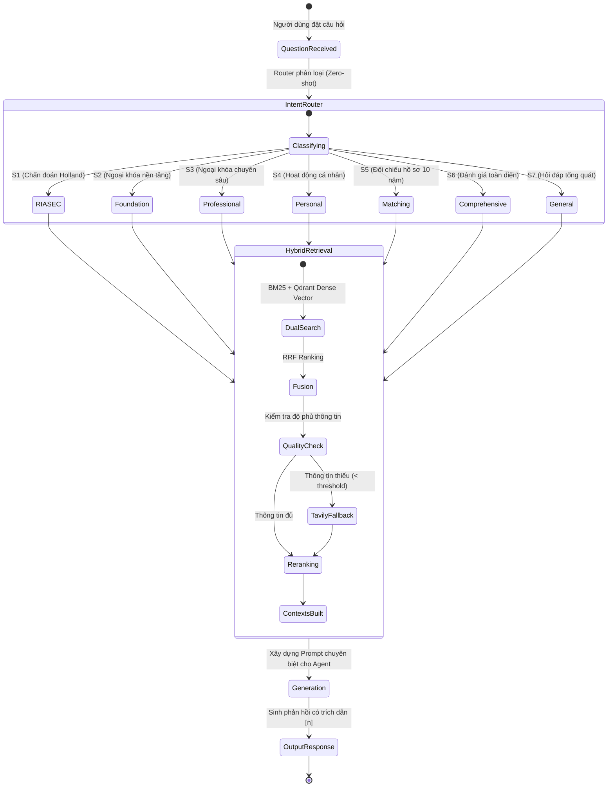

# Agent Flow Diagram: FBC4SAO

```mermaid
stateDiagram-v2
    [*] --> QuestionReceived: Người dùng đặt câu hỏi
    QuestionReceived --> IntentRouter: Router phân loại (Zero-shot)
    
    state IntentRouter {
        [*] --> Classifying
        Classifying --> RIASEC: S1 (Chẩn đoán Holland)
        Classifying --> Foundation: S2 (Ngoại khóa nền tảng)
        Classifying --> Professional: S3 (Ngoại khóa chuyên sâu)
        Classifying --> Personal: S4 (Hoạt động cá nhân)
        Classifying --> Matching: S5 (Đối chiếu hồ sơ 10 năm)
        Classifying --> Comprehensive: S6 (Đánh giá toàn diện)
        Classifying --> General: S7 (Hỏi đáp tổng quát)
    }

    RIASEC --> HybridRetrieval
    Foundation --> HybridRetrieval
    Professional --> HybridRetrieval
    Personal --> HybridRetrieval
    Matching --> HybridRetrieval
    Comprehensive --> HybridRetrieval
    General --> HybridRetrieval

    state HybridRetrieval {
        [*] --> DualSearch: BM25 + Qdrant Dense Vector
        DualSearch --> Fusion: RRF Ranking
        Fusion --> QualityCheck: Kiểm tra độ phủ thông tin
        QualityCheck --> TavilyFallback: Thông tin thiếu (< threshold)
        QualityCheck --> Reranking: Thông tin đủ
        TavilyFallback --> Reranking
        Reranking --> ContextsBuilt
    }

    HybridRetrieval --> Generation: Xây dựng Prompt chuyên biệt cho Agent
    Generation --> OutputResponse: Sinh phản hồi có trích dẫn [n]
    OutputResponse --> [*]
```
