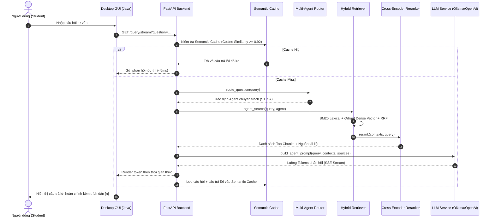

# Data Flow Diagram: FBC4SAO

```mermaid
sequenceDiagram
    autonumber
    actor User as Người dùng (Student)
    participant UI as Desktop GUI (Java)
    participant API as FastAPI Backend
    participant Cache as Semantic Cache
    participant Router as Multi-Agent Router
    participant Retriever as Hybrid Retriever
    participant Reranker as Cross-Encoder Reranker
    participant LLM as LLM Service (Ollama/OpenAI)

    User->>UI: Nhập câu hỏi tư vấn
    UI->>API: GET /query/stream?question=...
    API->>Cache: Kiểm tra Semantic Cache (Cosine Similarity >= 0.92)
    alt Cache Hit
        Cache-->>API: Trả về câu trả lời đã lưu
        API-->>UI: Gửi phản hồi tức thì (<5ms)
    else Cache Miss
        API->>Router: route_question(query)
        Router-->>API: Xác định Agent chuyên trách (S1..S7)
        API->>Retriever: agent_search(query, agent)
        Retriever->>Retriever: BM25 Lexical + Qdrant Dense Vector + RRF
        Retriever->>Reranker: rerank(contexts, query)
        Reranker-->>API: Danh sách Top Chunks + Nguồn tài liệu
        API->>LLM: build_agent_prompt(query, contexts, sources)
        LLM-->>API: Luồng Tokens phản hồi (SSE Stream)
        API-->>UI: Render token theo thời gian thực
        API->>Cache: Lưu câu hỏi + câu trả lời vào Semantic Cache
    end
    UI-->>User: Hiển thị câu trả lời hoàn chỉnh kèm trích dẫn [n]
```
