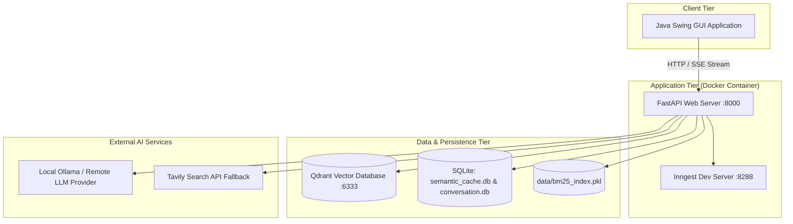

# Deployment Diagram: FBC4SAO

```mermaid
graph TD
    subgraph "Client Tier"
        Desktop[Java Swing GUI Application]
    end

    subgraph "Application Tier (Docker Container)"
        FastAPI[FastAPI Web Server :8000]
        Inngest[Inngest Dev Server :8288]
    end

    subgraph "Data & Persistence Tier"
        Qdrant[(Qdrant Vector Database :6333)]
        SQLite[(SQLite: semantic_cache.db & conversation.db)]
        BM25File[(data/bm25_index.pkl)]
    end

    subgraph "External AI Services"
        Ollama[Local Ollama / Remote LLM Provider]
        Tavily[Tavily Search API Fallback]
    end

    Desktop -->|HTTP / SSE Stream| FastAPI
    FastAPI --> Inngest
    FastAPI --> Qdrant
    FastAPI --> SQLite
    FastAPI --> BM25File
    FastAPI --> Ollama
    FastAPI --> Tavily
```
