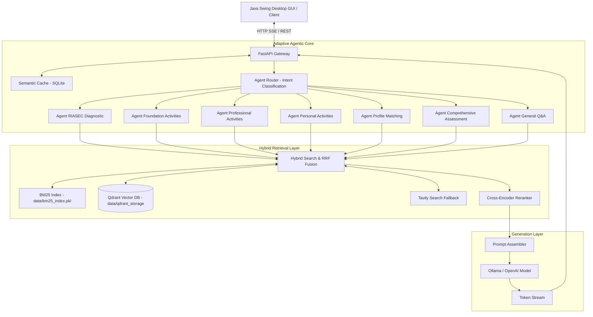

# System Overview Diagram: FBC4SAO

```mermaid
graph TD
    Client[Java Swing Desktop GUI / Client] <-->|HTTP SSE / REST| API[FastAPI Gateway]
    
    subgraph "Adaptive Agentic Core"
        API <--> Cache[Semantic Cache - SQLite]
        API --> Router[Agent Router - Intent Classification]
        Router --> A1[Agent RIASEC Diagnostic]
        Router --> A2[Agent Foundation Activities]
        Router --> A3[Agent Professional Activities]
        Router --> A4[Agent Personal Activities]
        Router --> A5[Agent Profile Matching]
        Router --> A6[Agent Comprehensive Assessment]
        Router --> A7[Agent General Q&A]
    end

    subgraph "Hybrid Retrieval Layer"
        A1 & A2 & A3 & A4 & A5 & A6 & A7 --> Hybrid[Hybrid Search & RRF Fusion]
        Hybrid <--> BM25[BM25 Index - data/bm25_index.pkl]
        Hybrid <--> Qdrant[(Qdrant Vector DB - data/qdrant_storage)]
        Hybrid <--> Web[Tavily Search Fallback]
        Hybrid --> Rerank[Cross-Encoder Reranker]
    end

    subgraph "Generation Layer"
        Rerank --> Context[Prompt Assembler]
        Context --> LLM[Ollama / OpenAI Model]
        LLM --> Stream[Token Stream]
        Stream --> API
    end
```
